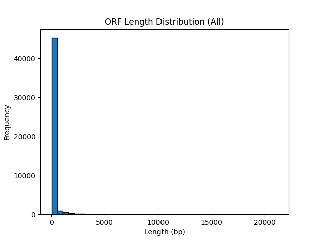
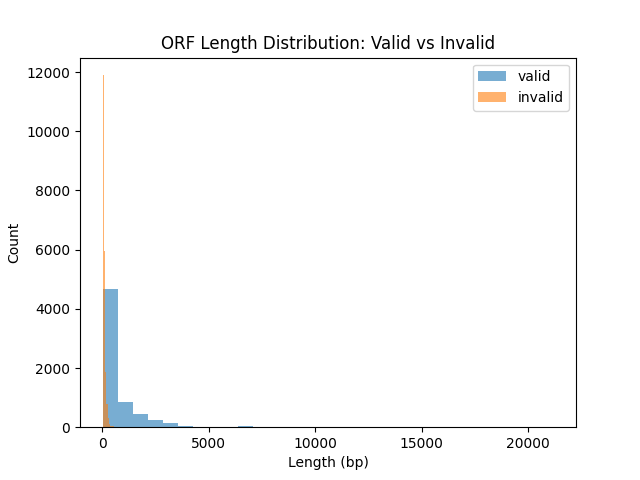

# ORF Extraction and Validation from a Human Transcriptome

## Project Overview

During this project, we aimed to extract Open Reading Frames (ORFs) from a human transcriptome assembly and validate them using Blast against the SwissProt protein database. To do that, we used Docker in order to work in a containerized environment, so that the results are reproducible, and transparent.

---

## The Objectives

- Extract ORFs from a partial human transcriptome FASTA file.
- Output the ORFs as both:
  - Multi-FASTA format (for downstream BLAST)
  - GFF format (for annotation)
- Validate ORFs using `blastx` against SwissProt using taxonomic filtering (`-taxids 9606`).
- Append validated hits to the GFF file.
- Assess the **false positive rate** (FPR).
- Visualize ORF size distribution and compare **true positives** vs **false positives**.

---

## Given Data (input)

- `Homo_sapiens_cdna_assembled.fasta` — partial human transcriptome which contained the ORFs to be analyzed.
- `swissprot` BLAST database (downloaded from NCBI) to cross with the fasta file in order to get the results.

---

## Environment Setup

First, I started with the creation of a Dockerfile based on `python:3.12-slim` to create a reproducible environment which was given in the html but modified to contain the `Biopython` library for FASTA parsing `pandas` and `matplotlib` for analysis and visualization. The original docker image extracts `NCBI BLAST+ v2.16.0` and its taxonomy database.

Then I set up the docker using `Git Bash` using the following commannds:

```bash
docker build -t blast:v2.16.0 .
docker run -it --rm -v "C:\path\to\project":/ORF blast:v2.16.0 bash
cd /ORF
export BLASTDB=/db/swissprot/swissprot
```

---

## Coding Steps

### 1. ORF Extraction (Part 1)

The first part of the code identifies non-overlapping ORFs starting with `ATG` and ending with `TAA`, `TAG`, or `TGA`. During the identification the ORFs are stored in a temporary list orfs. Once the identification is done the output are 2 files:
  - `orfs_output.fasta`: nucleotide sequences of ORFs
  - `orfs_output.gff`: genomic locations of ORFs

### 2. Validation with BLASTX

Then the second step is to parse the database in order to get only the correct number of valid ORFs that interest us and are related to human.

```bash
blastx -db /db/swissprot/swissprot \
       -query /ORF/orfs_output.fasta \
       -taxids 9606 \
       -outfmt 7 \
       -out /ORF/blast_results.tsv \
       -num_threads 4
```

### 3. Post-processing & Analysis (Part 2)

The 2nd part retains as *Valid hits*, only the hits with an `E-value` inferior to 1e-5. The results are written in the modified GFF which contains the validated CDS features. After that I was able to compute the False Positive Rate with the Validated and Invalid ORFs. For better analysis and as requested 2 forms of visualizations were presented, the Overall ORF length distribution and a Valid vs invalid ORF comparison.

---

## Results

### ORF Length Distribution



We can clearly see that the majority of the ORFs are short (< 1000 bp) and that Long ORFs, eventhough rare, but biologically relevant.

### 📊 Valid vs Invalid ORFs



- **Valid ORFs** colored in blue tend to be longer
- **False Positives** colored in orange are more numerous and shorter

### False Positive Rate

```
False Positive Rate: 0.76
```

which means that 76% of extracted ORFs did not match known protein-coding regions, suggesting high sensitivity but lower specificity in the raw ORF detection step.

---

## 🧠 Discussion

Through thi project, we go through a full bioinformatics pipeline from the raw `Homo_sapiens_cdna_assembled.fasta` fasta file to a validated gene prediction using standard tools and reproducible environments.

From the results we can also note that, the high false positive rate highlights the importance of a post-extraction validation. Furthermore the use of visualizations techniques provide insight into the biological relevance of ORF length which ones are more interesting and the thresholds to set.

Finally working with a structured code and Docker containerization make the pipeline robust and shareable through plateforms such as github.

---

## Future Improvements

- Add amino acid translation for FASTA outputs
- Integrate gene ontology (GO) annotations
- Explore filtering by minimum ORF length or coverage
- Consider nested ORFs and alternative reading frames

---

## File Outputs

| File | Description |
|------|-------------|
| `orfs_output.fasta` | Nucleotide ORF sequences |
| `orfs_output.gff` | GFF annotations of ORFs |
| `blast_results.tsv` | BLASTX results |
| `annotated_orfs.gff` | GFF with validated CDS |
| `orf_lengths_all.png` | Histogram of all ORF lengths |
| `orf_lengths_valid_vs_invalid.png` | Valid vs Invalid comparison |

---

`By Adam El Laham`